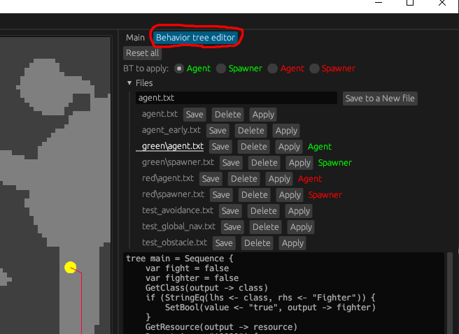
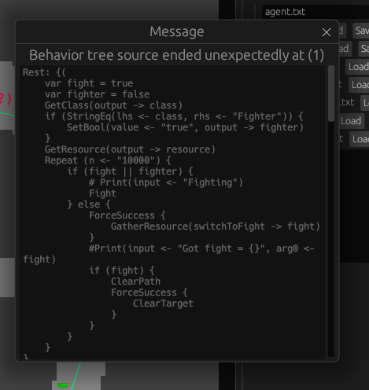
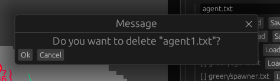
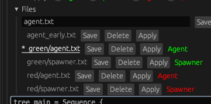
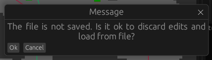
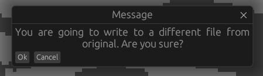
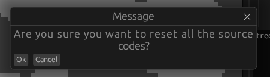

# swarm-rs

Swarm game in Rust

Try it now on your browser!
https://msakuta.github.io/swarm-rs/

## Screenshot


## Overview

This is a sister project of [swarm-js](https://github.com/msakuta/swarm-js) but implemented in Rust.

It is a simulation game environment that you can customize the simulated agents behavior via behavior tree.

This project utilizes a behavior tree via [behavior-tree-lite](https://github.com/msakuta/rusty-behavior-tree-lite) crate to define the behavior of the swarm agents.
It is dynamically configurable at runtime.

```
tree main = Sequence {
    Fallback {
        HasTarget (target <- target)
        FindEnemy
    }
    Fallback {
        HasPath (has_path <- has_path)
        FindPath
    }
    Sequence {
        HasPath (has_path <- has_path)
        Fallback {
            FollowPath
            ReactiveSequence {
                Move (direction <- "backward")
                Timeout (time <- "10")
            }
        }
        Shoot
    }
}
```


## How to run native application on PC

* Install [Rust](https://www.rust-lang.org/learn/get-started)

We have 2 versions of native application, using different GUI frameworks.

### eframe

* Run `cargo r -p swarm-rs-eframe`

### druid

* Run `cargo r -p swarm-rs-druid`

Note that Druid is being discontinued so we will drop support some time in the future.


## How to build Wasm version

You can build the application to WebAssembly and run on the browser.

* Install [Rust](https://www.rust-lang.org/learn/get-started)
* Install [wasm-pack](https://rustwasm.github.io/wasm-pack/)

We have 2 versions of wasm application, using different GUI frameworks.


### eframe

* Install [trunk](https://github.com/thedodd/trunk) by `cargo install trunk`
* Run `cd eframe && trunk serve` for development server, or
* Run `cd eframe && trunk build --release` for release build in `eframe/dist`

### druid

* Run `cd druid && wasm-pack build --release`
* Copy `druid/index.html` and `druid/index.js` to `druid/pkg`


## How to edit the behavior tree

There are tabs to switch the main panel to the editors on right top corner of the window.

You can edit the tree in-place with the integrated text editor, or edit it in a text editor and reload from file.
If you want to use VSCode to edit, check out the [syntax highlighting extension](https://github.com/msakuta/rusty-behavior-tree-lite/tree/master/vscode-ext).
In a native build, the files are served from [behavior_tree_config](./behavior_tree_config/) directory.



In order to load a behavior tree to a type of entity, do this:

* Select the type of entities (green Agent, green Spawner, etc.) in the radio buttons next to "BT to apply"
* Click "Apply" button on the side of each file name

It will assign the behavior tree to the type of entity and show it in a label next to the file buttons.

### Error reporting message

When a behavior tree is assigned, a syntax check will run on the behavior tree config file, and reports in a message box if there is an error.



### Delete confirmation


Also there is a confirmation dialog for deleting a file, in order to prevent the user from accidentally deleting an important file.




### "Dirty" editor buffer

We do not have multiple buffers like fancy editors (technically we do, inside virtual filesystem, but they are considered "saved to disk").
So, whenever you switch the file, you would lose the edited content. This "dirty" buffer is marked with a star.



If you try to open a file, it will warn you that it would lose your edits.




### Overwrite another file confirmation

When you try to save a file to a different file from original file, a confirmation dialog will show up.




### "Reset all" button

The user may mess up the files, for example, erasing an entire file or overwriting one with another, and we want to have a way to recover from it. It is easy to happen when you are new to this game and editor experience.

The "Reset all" button will reset all files to the built-in default, in both native and Wasm build. It is dangerous operation, so there is also a confirmation dialog.


